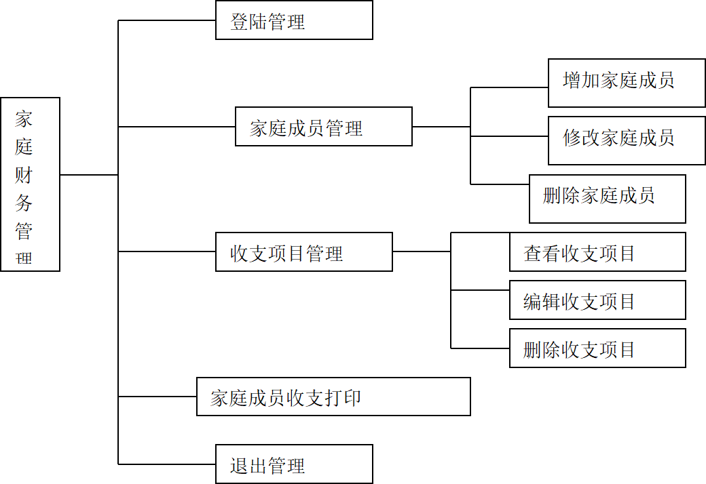

# 家庭财务管理

## 目的

收支管理是一个家庭日常生活中不可缺少的一部分，也是财务管理的重要组成部分。开发一个家庭财务管理系统，实现家庭财务信息的自动化。

## 系统主要功能

1. **登陆管理**：可以选一名家庭成员做管理员，普通用户只能查看自己的收支信息。
2. **家庭成员管理**：成员的信息包括姓名、性别、出生日期、年龄、身高、体重。
3. **收支项目管理**：可以设置收支项目，修改或者删除。收支项目要求分为两层，比如“车辆维护-保养费”；任意一层次都可作为收支项目记账，用户在不清楚支出是否属于“保养费”的时候，可以选择大类“车辆维护”作为支出项。
4. **家庭成员收支输出**：显示每个成员每月的收支情况（时间、收支种类、金额、经手人）。
5. **退出管理**：系统功能图如下图。
   

## 设计要求

1. 系统具有的功能应尽量全面。
2. 采用 GUI（图形用户接口）方式实现。
3. 使用类、向量（参看文献 VC 的 STL）。请分多次回答，要求代码简洁，最佳实践，每次回答结束后待我回复“继续”后继续回答。
4. GUI 版的关键技术：消息机制、窗口类、对话框与控件、菜单。
5. 数据存储可用文件或数据库任选。
6. 可以根据自己的了解定义收支种类：生化用品消费、工资、奖金、饮食消费。
